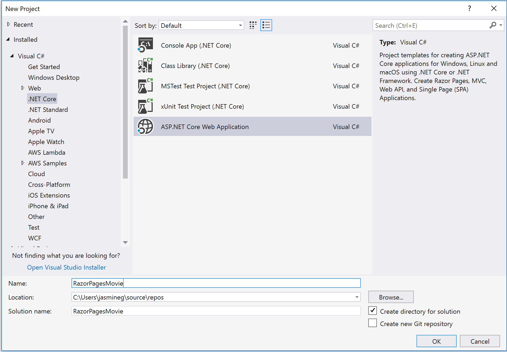
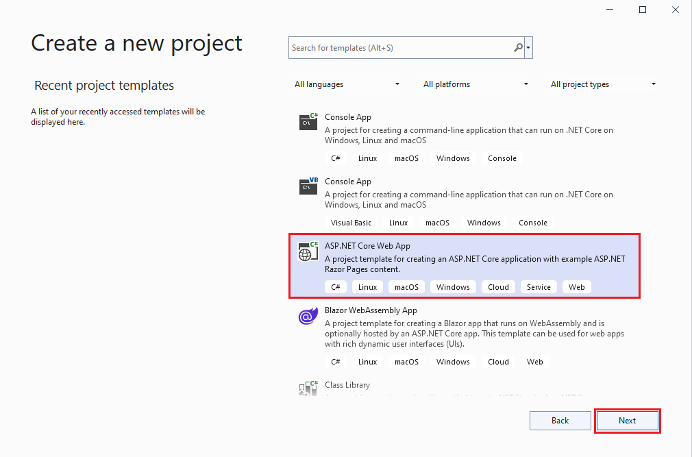
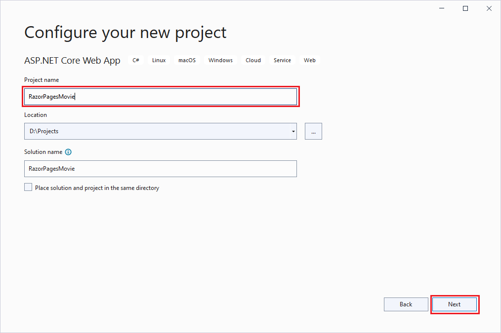
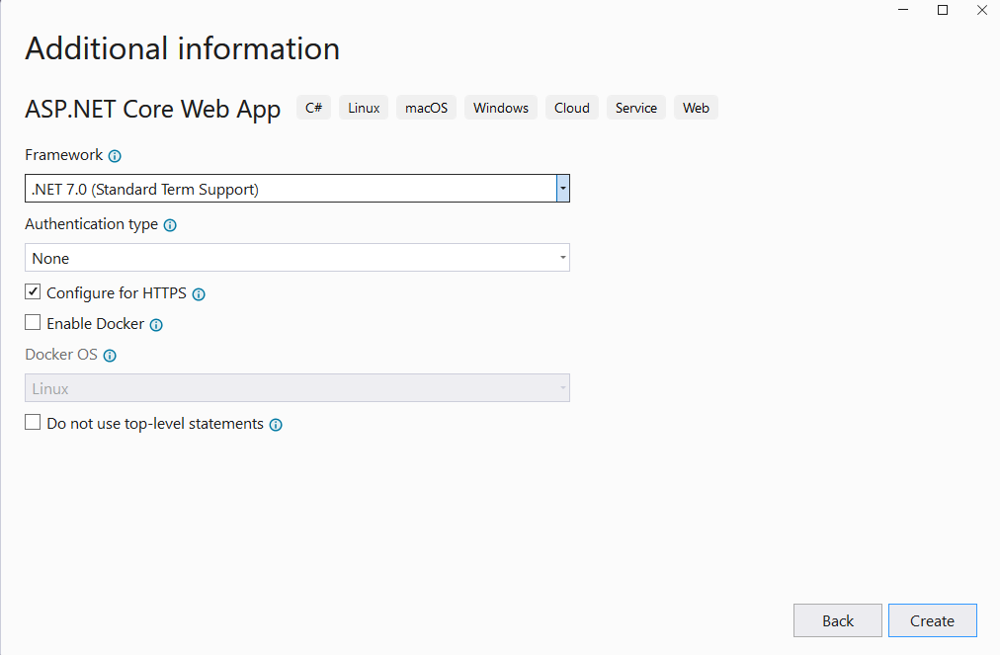
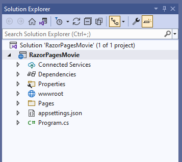
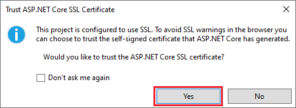
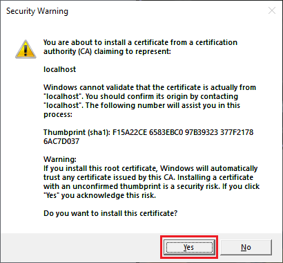

# Create a Razor Pages web app in Visual Studio

The following tutorial is based on [*"Get started with Razor Pages in ASP.NET Core"*](https://docs.microsoft.com/aspnet/core/tutorials/razor-pages/razor-pages-start) from docs.microsoft.com.

## Prerequisites

* [Visual Studio 2022](https://visualstudio.microsoft.com/downloads/?wt.mc_id=adw-brand&gclid=Cj0KCQjwqYfWBRDPARIsABjQRYwLe3b9dJMixA98s8nS8QfuNBKGsiRVRXzB93fe4E27LGK5KLrGcnYaAgdREALw_wcB)
* In the Visual Studio Installer, install the following workloads:
  * ASP.NET and web development

## Create a Razor web app

* Open Visual Studio and select **Create a new project**.

* Select **ASP.NET Core Web App** from the list of templates and select **Next**.

* Name the project RazorPagesMovie and select **Next**.

* Select **.NET 6.0 (Long-term support)** in the dropdown, and then select **Create**.

Visual Studio creates a starter project.

* Press F5 to run the app to view the project with the default template. If you get a prompt to trust the ASP.NET SSL Certificate, select **Yes** to trust the certificate and select **Yes** again to install the certificate.

The following image shows the site running with the default template:

## Project files and folders explained

The following table lists the files and folders associated in the project.

| Name                     | Description                                                                                         |
| ------------------------ |-----------------------------------------------------------------------------------------------------|
| *wwwroot/*               | Contains all the static files. For example CSS, images, and so on.                                  |
| *Pages/*                 | Contains Razor Pages and supporting files. Each Razor page is a pair of files: - A *.cshtml* file that contains markup with C# code using Razor syntax. - A *.cshtml.cs* `PageModel` class file that defines page handler methods and data used to render the page.                                                                                        |
| *RazorPagesMovie.csproj* | Contains configuration metadata for the project, such as dependencies.                              |
| *Program.cs*             | Serves as the app's managed entry point and configures app behavior, such as routing between pages. |  

**NEXT TUTORIAL** - [Adding a Model](../2-Add%20a%20model/Addamodel-VS.md)