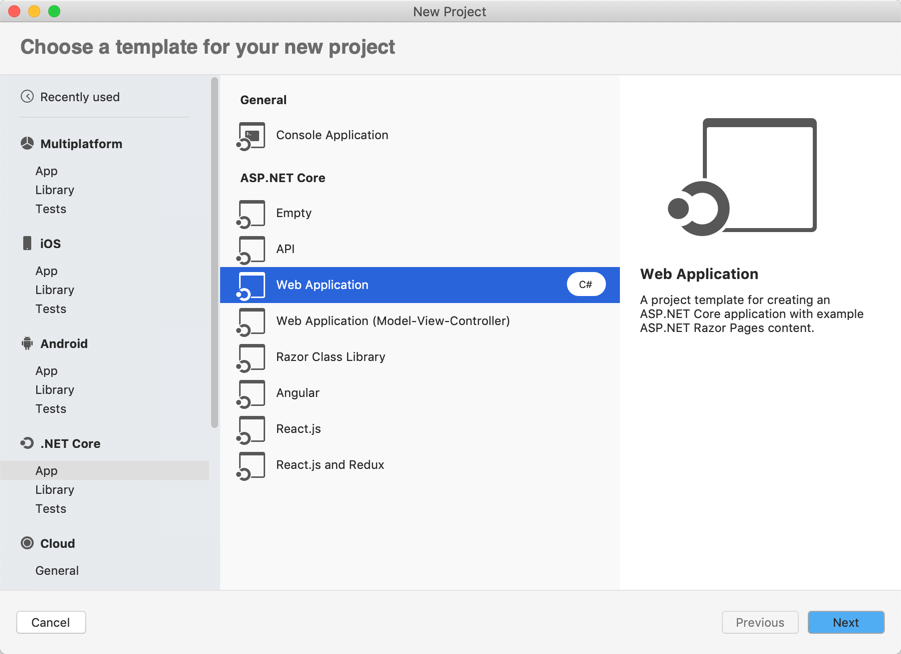
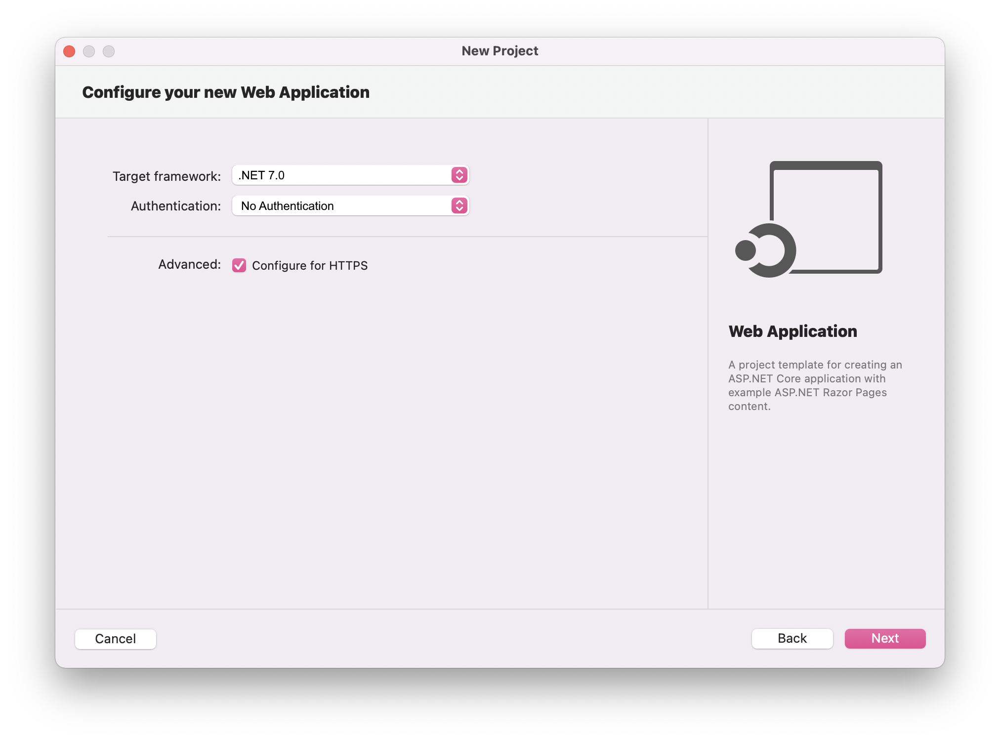
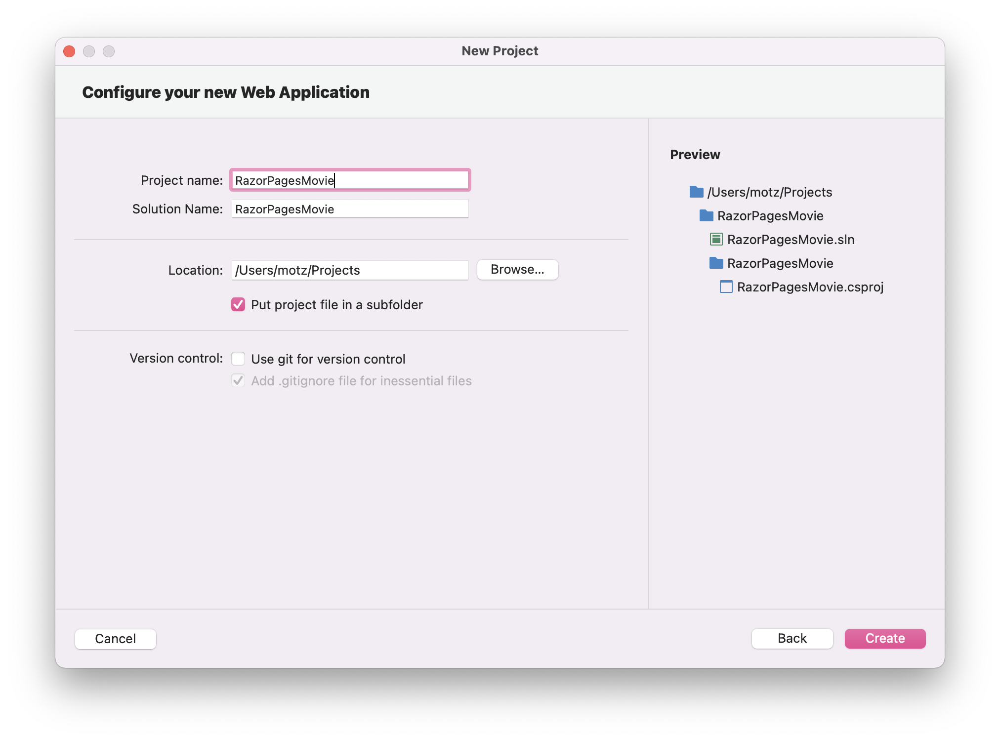
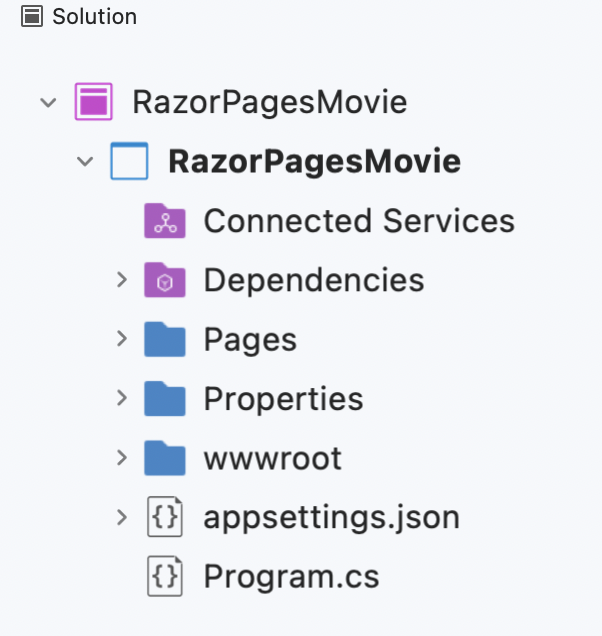
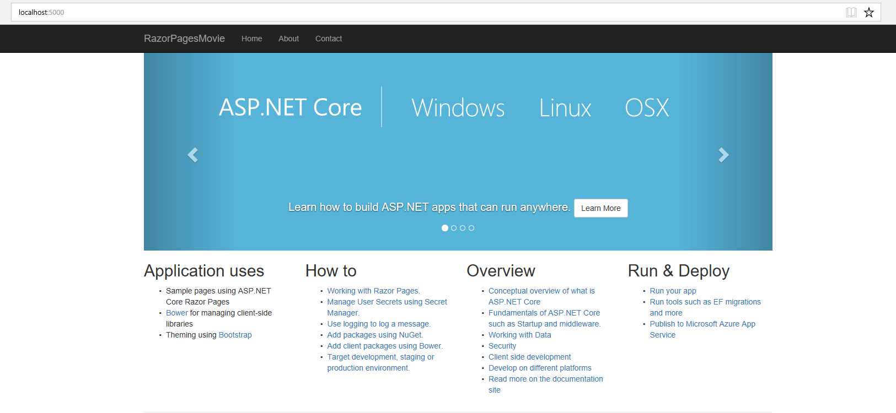

The tutorial below is based on [*"Get started with Razor Pages in ASP.NET Core"*](https://docs.microsoft.com/en-us/aspnet/core/tutorials/razor-pages/razor-pages-start) from docs.microsoft.com.

### Prerequisites
*  [Visual Studio 2019 for Mac](https://visualstudio.microsoft.com/downloads/?wt.mc_id=adw-brand&gclid=Cj0KCQjwqYfWBRDPARIsABjQRYwLe3b9dJMixA98s8nS8QfuNBKGsiRVRXzB93fe4E27LGK5KLrGcnYaAgdREALw_wcB)
* In the Visual Studio Installer, install the following workloads:
    * .NET Core

## Create a Razor web app

* From the Visual Studio File menu, select New Solution.
* Create a new ASP.NET Core Web Application with .NET Core > App > Web Application. Name the project RazorPagesMovie.

* Select ASP.NET Core 2.2 in the dropdown, and then select Web Application.    

* Name the project RazorPagesMovie.

The template creates a starter project.

* Run the application with Run > Start without Debugging.

#### Project Files and Folders explained

The following table lists the files and folders associated in the project.

| Files or Folders       | Purpose        |
| ------------- |-------------|
| wwwroot      | Contains all the static files. For example CSS, images etc. | 
| Pages     | This folder contains the pages for our application.      |    
| Startup.cs | Configures services  we use in our application. For example adding user authentication through Microsoft, Google or Facebook account.   |
| Program.cs | Host our ASP.NET Core application.*The host is responsible for app startup and lifetime management*     |  

**NEXT TUTORIAL** - [Adding a Model](../2-Add%20a%20model/Addamodel-VS.md)
