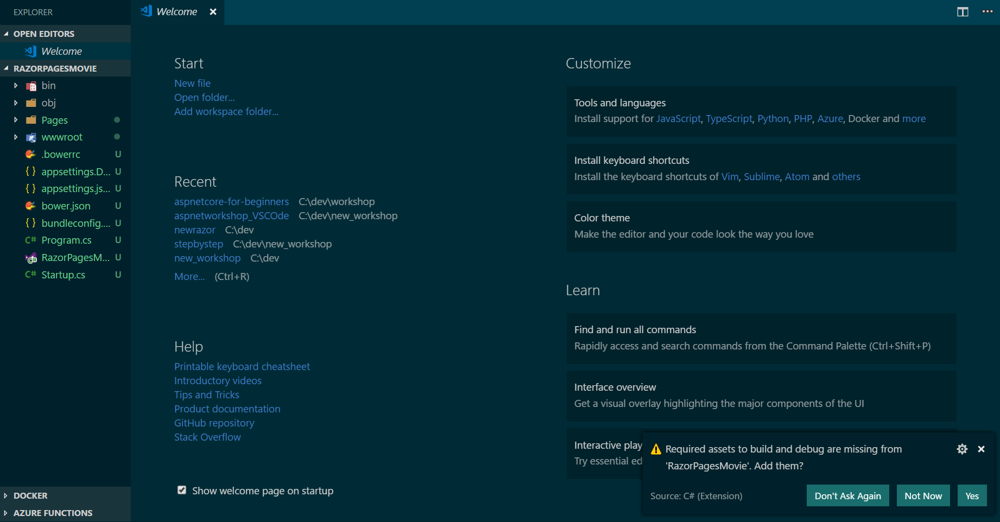

# Create a Razor Pages web app in Visual Studio Code

The following tutorial is based on [*"Get started with ASP.NET Core Razor Pages in Visual Studio Code"*](https://docs.microsoft.com/aspnet/core/tutorials/razor-pages-vsc/razor-pages-start) from docs.microsoft.com.

## Prerequisites

* [.NET 6 SDK](https://dotnet.microsoft.com/download/dotnet/6.0)
* [Visual Studio Code](https://code.visualstudio.com/?wt.mc_id=adw-brand&gclid=Cj0KCQjwqYfWBRDPARIsABjQRYwLe3b9dJMixA98s8nS8QfuNBKGsiRVRXzB93fe4E27LGK5KLrGcnYaAgdREALw_wcB)
* [C# Extension for VS Code](https://marketplace.visualstudio.com/items?itemName=ms-dotnettools.csharp)

## Create a Razor web app

Enter the following commands in the terminal:

 ```console
dotnet new razor -o RazorPagesMovie -f net6.0
cd RazorPagesMovie
dotnet run
```

Open a browser and browse to https://localhost:{PORT}/ to view the application. The {PORT} will be visible in the output in terminal.


#### Open project in VS Code

- Shut down your application using `Ctrl+C`.
- Open your project in VS Code using one of the following options 
    - select File > Open Folder, and then select the RazorPagesMovie folder
    - or enter the following command in the terminal `code .`
- Click **Yes** to the prompt *"Required assets to build and debug are missing from 'RazorPagesMovie'. Add them?"*



## Project files and folders explained

The following table lists the files and folders associated in the project.

| Name                     | Description                                                                                         |
| ------------------------ |-----------------------------------------------------------------------------------------------------|
| *wwwroot/*               | Contains all the static files. For example CSS, images, and so on.                                  |
| *Pages/*                 | Contains Razor Pages and supporting files. Each Razor page is a pair of files:<br/>- A *.cshtml* file that contains markup with C# code using Razor syntax.<br/>- A *.cshtml.cs* `PageModel` class file that defines page handler methods and data used to render the page.                                                                                        |
| *RazorPagesMovie.csproj* | Contains configuration metadata for the project, such as dependencies.                              |
| *Program.cs*             | Serves as the app's managed entry point and configures app behavior, such as routing between pages. |

**NEXT TUTORIAL** - [Adding a Model](../2-Add%20a%20model/Addamodel.md)
