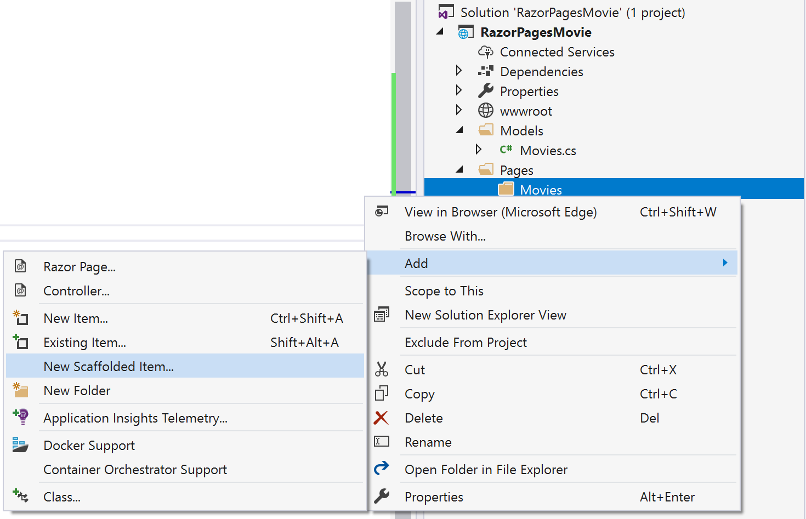
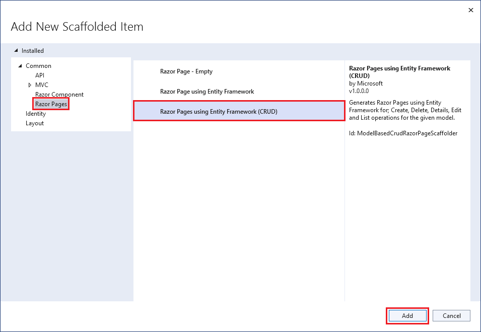
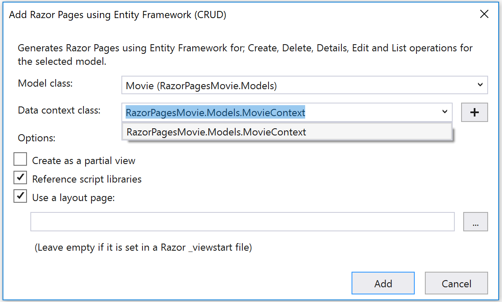
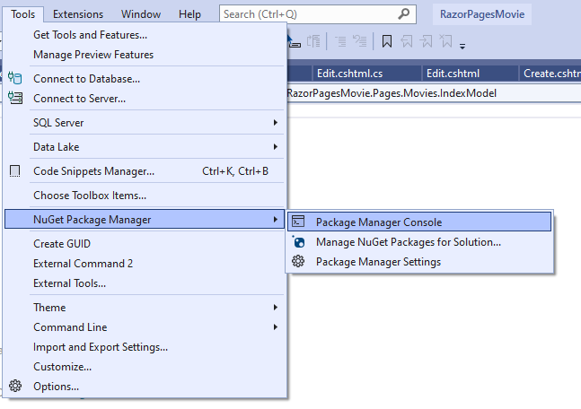

# Add a data model in Visual Studio - changes for PR

The following tutorial is based on [*"Get started with Razor Pages in ASP.NET Core"*](https://docs.microsoft.com/aspnet/core/tutorials/razor-pages/razor-pages-start) from docs.microsoft.com.

## Prerequisites

* [Visual Studio 2022](https://visualstudio.microsoft.com/downloads/?wt.mc_id=adw-brand&gclid=Cj0KCQjwqYfWBRDPARIsABjQRYwLe3b9dJMixA98s8nS8QfuNBKGsiRVRXzB93fe4E27LGK5KLrGcnYaAgdREALw_wcB)
* In the Visual Studio Installer, install the following workload:
  * ASP.NET and web development

* Tutorial 1- [Create a Razor Page application](../1-Create%20a%20Razor%20Page/Create-a-Razorpage-VS.md)

## Add a data model

In this section, you're adding classes to manage movies in a database.

1. In **Solution Explorer**, right-click the RazorPagesMovie project. Select **Add** > **New Folder**. Name the folder `Models`.
1. Right click the `Models` folder. Select **Add** > **Class**. Name the class `Movie`.
1. Replace the contents of the `Movie.cs` file with the following code:

    ```csharp
    namespace RazorPagesMovie.Models;
    
    public class Movie
    {
        public int ID { get; set; }
        public string? Title { get; set; }
        public DateTime ReleaseDate { get; set; }
        public string? Genre { get; set; }
        public decimal Price { get; set; }
    }
    ```

## Scaffold the movie model

1. In **Solution Explorer**, right click on the **Pages** folder. Select **Add** > **New Folder**.
1. Name the folder `Movies`.
1. In **Solution Explorer**, right click on the `Pages/Movies` folder. Select **Add** > **New Scaffolded Item**.
  
    

1. In the **Add New Scaffolded Item** dialog, select **Razor Pages** on the left pane and select **Razor Pages using Entity Framework (CRUD)** on the right pane. Then select **Add**.
  
    

1. Complete the **Add Razor Pages using Entity Framework (CRUD)** dialog:
   1. In the **Model class** drop down, select **Movie (RazorPagesMovie.Models)**.
   1. In the **Data context class** row, select the **+** (plus) sign.
      1. The **Add Data Context** dialog opens. Leave the default value and select **Add**. The class name `RazorPagesMovie.Data.RazorPagesMovieContext` is generated.
   1. Select **Add**.

    

The generated code from the scaffold process creates the following files:

* Pages/Movies/
  * Create
  * Delete
  * Details
  * Edit
  * Index
* Data/MovieContext.cs: Class that includes a `DbSet` property for the entity set. An entity set typically corresponds to a database table, and entity corresponds to a row in the table.

The scaffold process also modifies some existing files:

* Startup.cs: Created a DB context and registered it with the dependency injection container.
* appsettings.json: The connection string used to connect to a local database is added.

## Use SQLite as the Database

When we scaffolded the database, SqlServer was selected as the default and is a great option for developer ASP.NET Core applications that need a database. For this application let's switch the database use SQLite, small, fast, self-contained, high-reliability, full-featured, SQL database engine. This is easy to do in just a few step:

1. From the **Tools** menu, select **NuGet Package Manager** > **Package Manager Console**.

1. Run the following command:

```cli
Install-Package Microsoft.EntityFrameworkCore.Sqlite
```

1. Update the connection string found in the `appsettings.json`: Change

```json
"ConnectionStrings": {
    "RazorPagesMovieContext": "Server=(localdb)\\mssqllocaldb;Database=RazorPagesMovieContext-5fff187f-3f2c-4d38-9b74-1812d4621ed3;Trusted_Connection=True;MultipleActiveResultSets=true"
  }
```

to the following:

```json
  "ConnectionStrings": {
    "RazorPagesMovieContext": "Data Source=MvcMovie.db"
  }
```

1. Update the `AddDbContext` registration in the `Program.cs` from:

```csharp
builder.Services.AddDbContext<RazorPagesMovieContext>(options =>
    options.UseSqlServer(builder.Configuration.GetConnectionString("RazorPagesMovieContext")));
```

to the following:

```csharp
    var connectionString = builder.Configuration.GetConnectionString("RazorPagesMovieContext");
    builder.Services.AddSqlite<RazorPagesMovieContext>(connectionString);
```

## Perform initial migration

1. From the **Tools** menu, select **NuGet Package Manager** > **Package Manager Console**.



* In the Package Manager Console, enter the following commands:

```
Add-Migration Initial
Update-Database
```

## Test your app

1. Press F5 to run your app.
1. Append /movies to the URL in the browser: http://localhost:port/movies

    

1. Create a new entry with the **Create** link:

    

    It works!

    

1. Test the Edit, Details and Delete links
  
If you get a SQL exception, verify you have run migrations and updated the database.

**Extra light read 7 minutes**: If you want to read more on pages you just created [click here for more information](https://docs.microsoft.com/aspnet/core/tutorials/razor-pages/page).

**NEXT TUTORIAL:** [Modifying generated pages](../3-Update%20Pages/update-VS.md)
