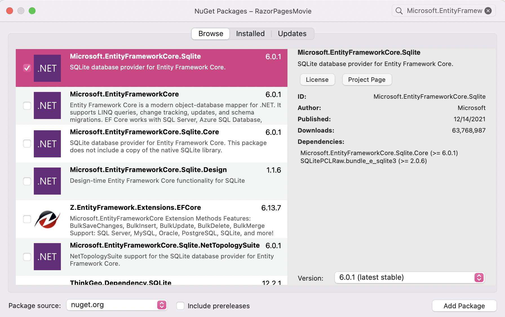

# Add a data model in Visual Studio for Mac

The following tutorial is based on [*"Get started with Razor Pages in ASP.NET Core"*](https://docs.microsoft.com/aspnet/core/tutorials/razor-pages/razor-pages-start) from docs.microsoft.com.

## Prerequisites

* [Visual Studio 2022 for Mac Preview](https://visualstudio.microsoft.com/vs/mac/preview/?wt.mc_id=adw-brand&gclid=Cj0KCQjwqYfWBRDPARIsABjQRYwLe3b9dJMixA98s8nS8QfuNBKGsiRVRXzB93fe4E27LGK5KLrGcnYaAgdREALw_wcB)
* In the Visual Studio for Mac Installer, install the .NET Core target.
* Tutorial 1- [Create a Razor Page application](../1-Create%20a%20Razor%20Page/Create-a-Razorpage-VSMac.md)

## Add a data model

In this section, you'll be adding classes to manage movies in a database.

1. In **Solution Pad**, right-click the RazorPagesMovie project. Select **Add** > **New Folder**. Name the folder `Models`.
1. Right click the `Models` folder. Select **Add** > **New Class**.
1. Select **General** > **Empty Class** and name the class `Movie`.

    

1. Replace the contents of the `Movie.cs` file with the following code:

    ```csharp
    namespace RazorPagesMovie.Models;
    
    public class Movie
    {
        public int ID { get; set; }
        public string? Title { get; set; }
        public DateTime ReleaseDate { get; set; }
        public string? Genre { get; set; }
        public decimal Price { get; set; }
    }
    ```

## Add NuGet Sqlite and Entity Framework Core

Now, let's add NuGet package for the Sqlite provider for Entity Framework Core that will enable you to have a database for your web app.

1. In **Solution Pad**, right-click the RazorPagesMovie project and select **Manage NuGet Packages**.

    

1. Search for `Microsoft.EntityFrameworkCore.Sqlite`.
1. Check the checkbox for the package and select **Add Package**.

    

Repeat this to add the following packages:

* `Microsoft.EntityFrameworkCore.Design`
* `Microsoft.EntityFrameworkCore.SqlServer`
* `Microsoft.VisualStudio.Web.CodeGeneration.Design`

## Add a database context class

* Right click the Models folder. Select **Add** > **New Class**.
* Select **General** > **Empty Class** and name the class `MovieContext`.

The database context, or `DbContext`, is a class provided by Entity Framework to facilitate database interactions.

``` cs
using Microsoft.EntityFrameworkCore;

namespace RazorPagesMovie.Models;

public class MovieContext : DbContext 
{
    public MovieContext(DbContextOptions<MovieContext> options) 
        : base(options) 
    {
    }

    public DbSet<Movie> Movie => Set<Movie>();
}
```

The previous code creates a `DbSet`  property for the entity set. An entity set typically corresponds to a database table, and an entity corresponds to a row in the table.

## Add a connection string

Open the `appsettings.json` file and add the `MovieContext` connection string as shown in the following code:

``` json
{
  "Logging": {
    "LogLevel": {
      "Default": "Information",
      "Microsoft.AspNetCore": "Warning"
    }
  },
  "AllowHosts": "*",
  "ConnectionStrings": {
    "MovieContext": "Data Source=MvcMovie.db"
  }
}
```

## Register the database context

1. Open the `Program.cs` file.
2. Add the following using directive at the top of the file.

   ```cs
   using RazorPagesMovie.Models;
   ```

3. Add the following code under `builder.Services.AddRazorPages();`:

    ``` cs
    var connectionString = builder.Configuration.GetConnectionString("MovieContext");
    builder.Services.AddSqlite<MovieContext>(connectionString);
    ```

## Perform initial migration

To run commands to create and manage migrations, you need to install the `dotnet ef` tool. Do that with the following command in the terminal (you can open a terminal inside of Visual Studio for Mac by right clicking on the project and selecting **Open in Terminal**).

```console
dotnet tool install --global dotnet-ef
```

> Tip:
> If `dotnet-ef` is already installed, you can update it with `dotnet tool update --global dotnet-ef`.

For more information, see [Entity Framework Core tools reference - .NET Core CLI](https://docs.microsoft.com/ef/core/cli/dotnet).

In the terminal, run the following commands in the project directory:

 ```console
dotnet ef migrations add InitialCreate
dotnet ef database update
```

Commands Explained

| Command       |Description       |
| ------------- |-------------|
| ` add package`    | installs the tools needed |
| `ef migrations add InitialCreate`     | generates code to create the initial database schema based on the model specified in 'MovieContext.cs'. `InitialCreate` is the name of the migrations. |  
|`ef database update` | creates the database      |

## Scaffold the movie model

Install the `aspnet-codegenerator` global tool by running the following command:

 ```console
dotnet tool install --global dotnet-aspnet-codegenerator
```

> Tip:
> If `dotnet-aspnet-codegenerator` is already installed, you can update it with `dotnet tool update --global dotnet-aspnet-codegenerator`.

> Note:
> You need to close and reopen the console window to be able to use this tool.

Run the following command:

`dotnet aspnet-codegenerator razorpage -m Movie -dc MovieContext -udl -outDir Pages/Movies --referenceScriptLibraries`

## Test your app

1. Build the application with **Build > Rebuild Solution**.
1. Run the application with **Debug > Start without Debugging**.
1. Append /movies to the URL in the browser: https://localhost:{port}/movies

    

1. Create a new entry with the Create link.

    

    It works!

    

1. Test the Edit, Details and Delete links
  
If you get a SQL exception, verify you have run migrations and updated the database.

**Extra light read 7 minutes**: If you want to read more on pages you just created, see the [Part 3, scaffolded Razor Pages in ASP.NET Core](https://docs.microsoft.com/aspnet/core/tutorials/razor-pages-vsc/page) article.

**NEXT TUTORIAL** - [Modifying generated pages](../3-Update%20Pages/update-VSMac.md)
