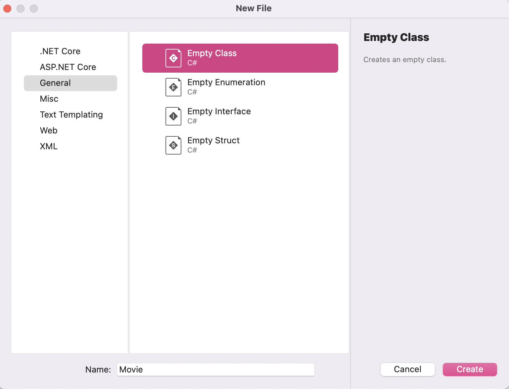
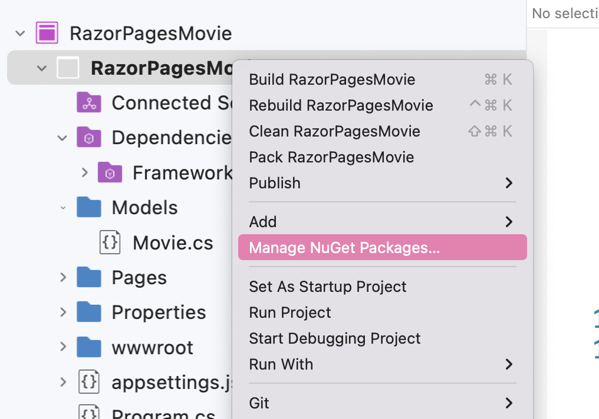
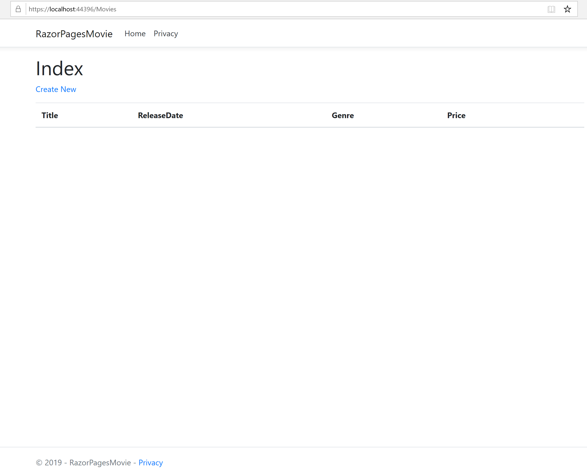
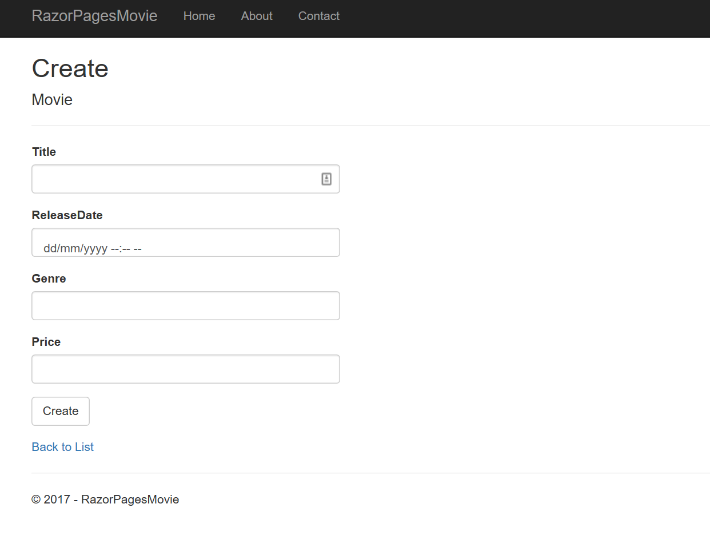
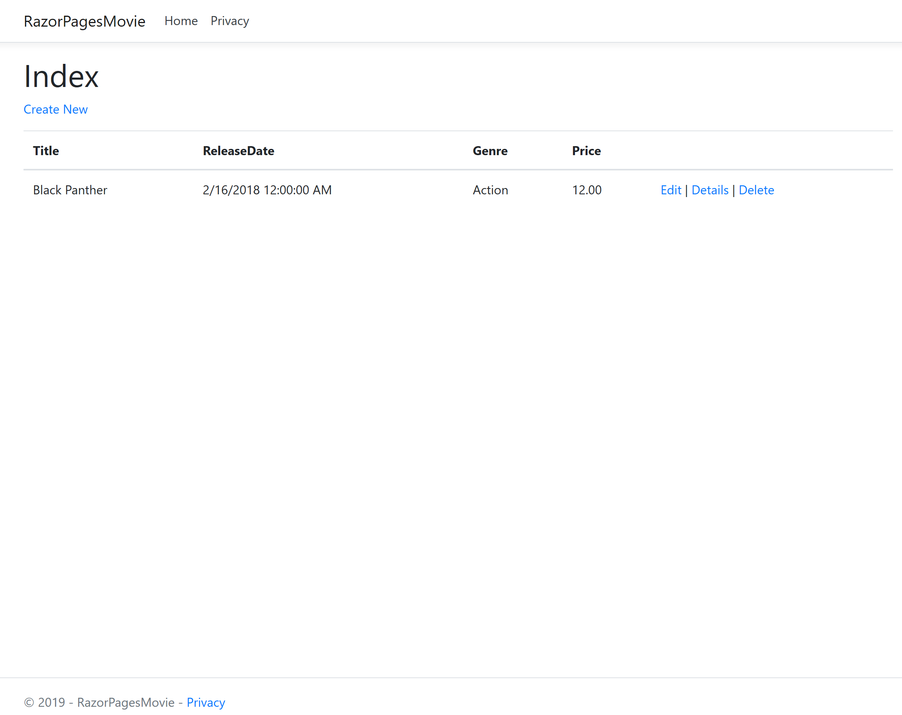

The following tutorial is based on [*"Get started with Razor Pages in ASP.NET Core"*](https://docs.microsoft.com/aspnet/core/tutorials/razor-pages/razor-pages-start) from docs.microsoft.com.

### Prerequisites

* [Visual Studio 2022 for Mac Preview](https://visualstudio.microsoft.com/vs/mac/preview/?wt.mc_id=adw-brand&gclid=Cj0KCQjwqYfWBRDPARIsABjQRYwLe3b9dJMixA98s8nS8QfuNBKGsiRVRXzB93fe4E27LGK5KLrGcnYaAgdREALw_wcB)
* In the Visual Studio for Mac Installer, install the .NET Core target.
* Tutorial 1- [Create a Razor Page application](../1-Create%20a%20Razor%20Page/Create-a-Razorpage-VSMac.md)

## Add a data model
In this section, we are adding classes to manage movies in a database.

* In Solution Pad, right-click the RazorPagesMovie project > Add > New Folder. Name the folder Models.
* Right click the Models folder. Select Add > New File.
* Select General > Empty Class and name the class `Movie`.



#### Add the code below to Movie.cs

```csharp
using System;

namespace RazorPagesMovie.Models
{
    public class Movie
    {
        public int ID { get; set; }
        public string Title { get; set; }
        public DateTime ReleaseDate { get; set; }
        public string Genre { get; set; }
        public decimal Price { get; set; }
    }
}

```

#### Add a database context class
Create a new class named `MovieContext.cs` in the Models folder. The database context, or `DbContext`, is a class provided by Entity Framework to facilitate database interactions.

``` cs
using Microsoft.EntityFrameworkCore;
using Microsoft.EntityFrameworkCore.Design;

namespace RazorPagesMovie.Models {
    public class MovieContext : DbContext {
        public MovieContext(DbContextOptions<MovieContext> options)
                : base(options) {
        }

        public DbSet<Movie> Movie { get; set; }
    }


    public class MovieContextFactory : IDesignTimeDbContextFactory<MovieContext> {
        public MovieContext CreateDbContext(string[] args) {
            var optionsBuilder = new DbContextOptionsBuilder<MovieContext>();
            optionsBuilder.UseSqlite("Data Source=MvcMovie.db");

            return new MovieContext(optionsBuilder.Options);
        }
    }
}
```
The code above creates a `DbSet`  property for the entity set. An entity set typically corresponds to a database table, and an entity corresponds to a row in the table.

#### Add a connection string

Open the `appsettings.json` file and add the `MovieContext` connection string as shown below.
``` json
{
  "Logging": {
    "IncludeScopes": false,
    "LogLevel": {
      "Default": "Warning"
    }
  },
  "ConnectionStrings": {
    "MovieContext": "Data Source=MvcMovie.db"
  }
}
```
#### Register the database context
Open Startup.cs file and add the code below to the ConfigureServices method.
``` cs
public void ConfigureServices(IServiceCollection services)
{
    services.AddRazorPages();
    services.Configure<CookiePolicyOptions>(options =>
    {
        // This lambda determines whether user consent for non-essential cookies is needed for a given request.
        options.CheckConsentNeeded = context => true;
        options.MinimumSameSitePolicy = SameSiteMode.None;
    });

    services.AddDbContext<MovieContext>(options => options.UseSqlite(Configuration.GetConnectionString("MovieContext")));
    services.AddMvc().AddMvcOptions(opt => opt.EnableEndpointRouting = false);
}
```
Add the following using statements: `using RazorPagesMovie.Models` and `using Microsoft.EntityFrameworkCore`.

#### Add NuGet packages for scaffolding and Sqlite

You will add two NuGet packages to the project.

 - `Microsoft.VisualStudio.Web.CodeGeneration.Design`
 - `Microsoft.EntityFrameworkCore.Sqlite`
 - `Microsoft.EntityFrameworkCore.Design`
 - `Microsoft.EntityFrameworkCore.SqlServer`

Add the `Microsoft.VisualStudio.Web.CodeGeneration.Design` to the project. Right click on Dependencies and select Add Packages in Solution Pad for the project. In the Add Packages dialog, search for Microsoft.VisualStudio.Web.CodeGeneration.Design. Check the checkbox and click Add Package.



Repeat this to add the `Microsoft.EntityFrameworkCore.Sqlite` and `Microsoft.EntityFrameworkCore.Design` and `Microsoft.EntityFrameworkCore.SqlServer` packages.

#### Perform initial migration

To run commands to create and manage migrations, you need to install the `dotnet ef` tool. Do that with the
following command in the terminal.

```console
dotnet tool install --global dotnet-ef --version 3.0.0-*
```

For more info see https://docs.microsoft.com/ef/core/miscellaneous/cli/dotnet.

In the terminal run the following commands in the project directory
 ```console
dotnet ef migrations add InitialCreate
dotnet ef database update
```
Commands Explained

| Command       |Description       |
| ------------- |-------------|
| ` add package`    | installs the tools needed |
| `ef migrations add InitialCreate`     | generates code to create the initial database schema based on the model specified in 'MovieContext.cs'. `InitialCreate` is the name of the migrations. |  
|`ef database update` | creates the database      |

#### Scaffold the movie model

Install the `aspnet-codegenerator` global tool by running the following command:

 ```console
dotnet tool install --global dotnet-aspnet-codegenerator
```

> Note: You will need to close and reopen the console window to be able to use this tool.

Run the command below

`dotnet aspnet-codegenerator razorpage -m Movie -dc MovieContext -udl -outDir Pages/Movies --referenceScriptLibraries`

#### Test your app
* Run the application with Run > Start without Debugging.
* Append /movies to the URL in the browser: http://localhost:port/movies



* Create a new entry with the Create link



* It works!



* Test the Edit, Details and Delete links
  
If you get a SQL exception, verify you have run migrations and updated the database.

**Extra light read 7 minutes**: If you want to read more on pages we just created [click here for more information](https://docs.microsoft.com/aspnet/core/tutorials/razor-pages/page).

**NEXT TUTORIAL** - [Modifying generated pages](../3-Update%20Pages/update-VSMac.md)