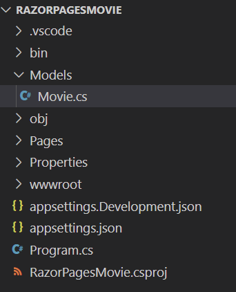

The tutorial below is based on [*"Get started with ASP.NET Core Razor Pages in Visual Studio Code"*](https://docs.microsoft.com/en-us/aspnet/core/tutorials/razor-pages-vsc/razor-pages-start) from docs.microsoft.com.

### Prerequisites
* [.NET Core SDK 2.2](https://www.microsoft.com/net/download/)
*  [Visual Studio Code](https://code.visualstudio.com/?wt.mc_id=adw-brand&gclid=Cj0KCQjwqYfWBRDPARIsABjQRYwLe3b9dJMixA98s8nS8QfuNBKGsiRVRXzB93fe4E27LGK5KLrGcnYaAgdREALw_wcB)
* Tutorial 1- [Create a Razor Page application](../1-Create%20a%20Razor%20Page/Create-a-Razorpage.md)

  
## Add a data model
In this section, we are adding classes to manage movies in a database.
- Add a folder named Models
- Add a class to Models folder named Movie.cs



#### Add the code below to Movie.cs
```
using System;

namespace RazorPagesMovie.Models
{
    public class Movie
    {
        public int ID { get; set; }
        public string Title { get; set; }
        public DateTime ReleaseDate { get; set; }
        public string Genre { get; set; }
        public decimal Price { get; set; }
    }
}
```
#### Add a database context class
Create a new class named `MovieContext.cs` in the Models folder. The database context, or `DbContext`, is a class provided by Entity Framework to facilitate database interactions.
```
using Microsoft.EntityFrameworkCore;

namespace RazorPagesMovie.Models
{
    public class MovieContext : DbContext
    {
        public MovieContext(DbContextOptions<MovieContext> options)
                : base(options)
        {
        }

        public DbSet<Movie> Movie { get; set; }
    }
}
```
The code above creates a `DbSet`  property for the entity set. An entity set typically corresponds to a database table, and an entity corresponds to a row in the table.

#### Add a connection string

Open the `appsettings.json` file and add the `MovieContext` connection string as shown below.
```
{
  "Logging": {
    "IncludeScopes": false,
    "LogLevel": {
      "Default": "Warning"
    }
  },
  "ConnectionStrings": {
    "MovieContext": "Data Source=MvcMovie.db"
  }
}
```
#### Register the database context
Open Startup.cs file and add the code below to the ConfigureServices method.
```
public void ConfigureServices(IServiceCollection services)
{
    services.Configure<CookiePolicyOptions>(options =>
    {
        // This lambda determines whether user consent for non-essential cookies is needed for a given request.
        options.CheckConsentNeeded = context => true;
        options.MinimumSameSitePolicy = SameSiteMode.None;
    });

    services.AddDbContext<MovieContext>(options => options.UseSqlite(Configuration.GetConnectionString("MovieContext")));
    services.AddMvc().SetCompatibilityVersion(CompatibilityVersion.Version_2_1);
}
```
Add the following using statements: `using RazorPagesMovie.Models` and `using Microsoft.EntityFrameworkCore`.

#### Add scaffold tooling and perform initial migration

In the command line run the following commands
```
dotnet add package Microsoft.VisualStudio.Web.CodeGeneration.Design
dotnet add package Microsoft.EntityFrameworkCore.Sqlite
dotnet restore
dotnet ef migrations add InitialCreate
dotnet ef database update
```
Commands Explained

| Command       |Description       |
| ------------- |-------------|
| ` add package`    | installs the tools needed |
| `ef migrations add InitialCreate`     | generates code to create the initial database schema based on the model specified in 'MovieContext.cs'. `InitialCreate` is the name of the migrations. |  
|`ef database update` | creates the database      |

#### Scaffold the movie model

Install the `aspnet-codegenerator` global tool by running the following command:

```
dotnet tool install --global dotnet-aspnet-codegenerator --version 2.1.1
```

> Note: You will need to close and reopen the console window to be able to use this tool.

Run the commands below

*On Windows*

`dotnet aspnet-codegenerator razorpage -m Movie -dc MovieContext -udl -outDir Pages\Movies --referenceScriptLibraries`

*On Mac and Linux*

`dotnet aspnet-codegenerator razorpage -m Movie -dc MovieContext -udl -outDir Pages/Movies --referenceScriptLibraries`
#### Test your app
1. Run the app `dotnet run`
1. Launch a browser and go to `http://localhost:5000/movies`


1. Create a new entry


- It works!


- Test Edit, Details and Delete links
- 
**Extra light read 7 minutes**: If you want to read more on pages we just created [click here for more information](https://docs.microsoft.com/en-us/aspnet/core/tutorials/razor-pages-vsc/page).

**NEXT TUTORIAL** :[Modifying generated pages](../3-Update%20Pages/update.md)
