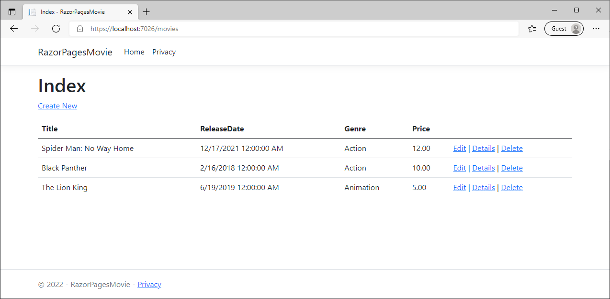
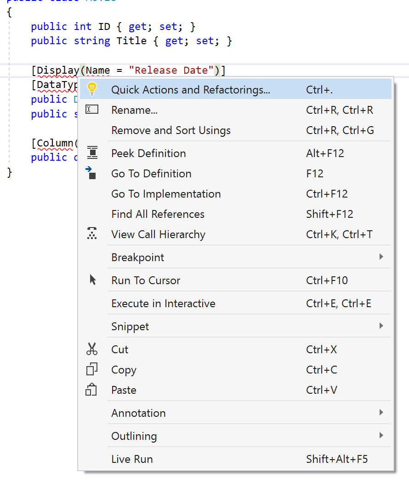
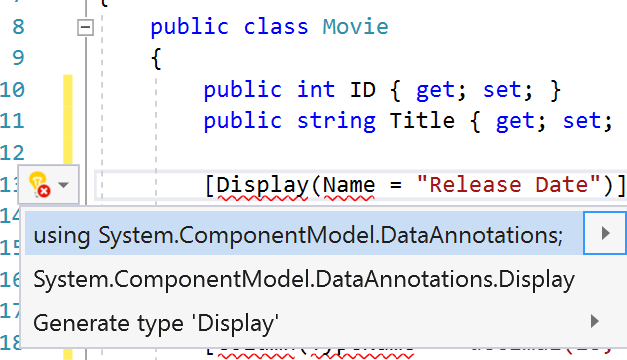
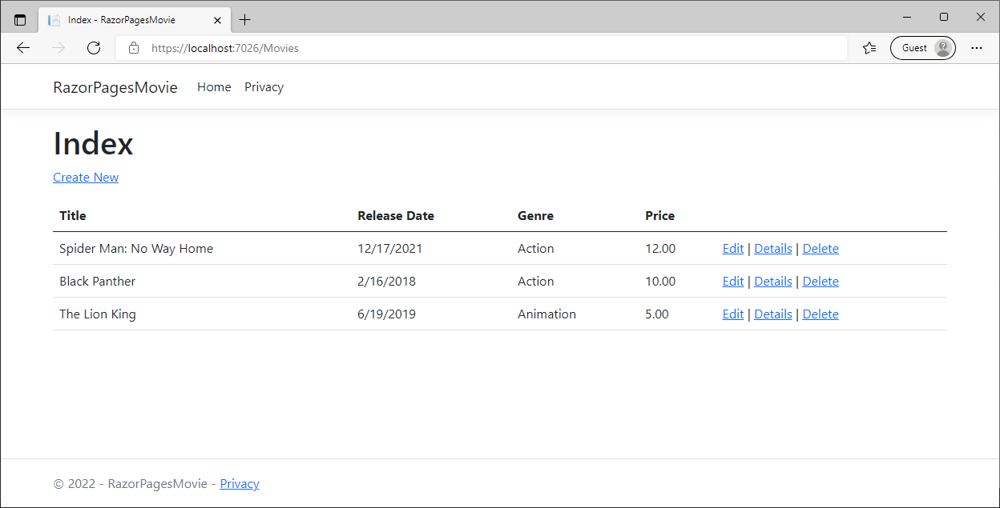

# Update pages in Visual Studio

The following tutorial is based on [*"Get started with Razor Pages in ASP.NET Core"*](https://docs.microsoft.com/aspnet/core/tutorials/razor-pages/razor-pages-start) from docs.microsoft.com.

## Prerequisites

* [Visual Studio 2022](https://visualstudio.microsoft.com/downloads/?wt.mc_id=adw-brand&gclid=Cj0KCQjwqYfWBRDPARIsABjQRYwLe3b9dJMixA98s8nS8QfuNBKGsiRVRXzB93fe4E27LGK5KLrGcnYaAgdREALw_wcB)
* In the Visual Studio Installer, install the following workload:
  * ASP.NET and web development
* Tutorial 1- [Create a Razor Page application](../1-Create%20a%20Razor%20Page/Create-a-Razorpage-VS.md)
* Tutorial 2- [Add a Model](../2-Add%20a%20model/Addamodel-VS.md)

## Update generated Pages



In this tutorial, you're going to learn how to update the generated pages. For example, suppose you want to remove the time from the release date.

1. Open the `Models/Movie.cs` file.
1. Replace the contents of the `Movie.cs` file with the following code:

    ```csharp
    namespace RazorPagesMovie.Models;

    public class Movie
    {
        public int ID { get; set; }
        public string? Title { get; set; }

        [Display(Name = "Release Date")]
        [DataType(DataType.Date)]
        public DateTime ReleaseDate { get; set; }
        public string? Genre { get; set; }

        [Column(TypeName = "decimal(18, 2)")]
        public decimal Price { get; set; }
    }
    ```

1. Right click on a red line and select **Quick Actions and Refactorings** on the [Display] attribute.

    

1. Select **using System.ComponentModel.DataAnnotations;**.

    

1. Right click on the remaining red line and select **Quick Actions and Refactorings** on the [Column] attribute.
1. Select **using System.ComponentModel.DataAnnotations.Schema;**.
1. Press F5 to run the app.
1. Navigate to `https://localhost:{port}/Movies/Create` and notice the changes.

    
   

**NEXT TUTORIAL:** [Adding search](../4-Add%20Search/SearchPage-VS.md)
