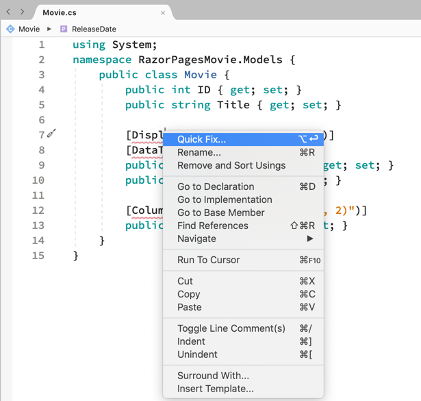
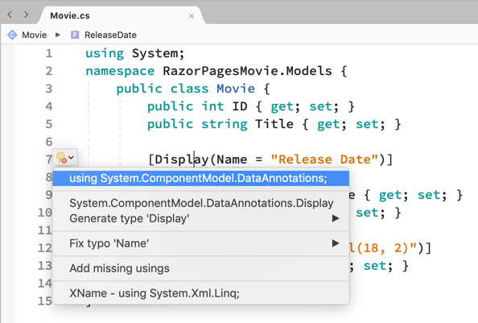

# Update pages in Visual Studio for Mac

The following tutorial is based on [*"Get started with Razor Pages in ASP.NET Core"*](https://docs.microsoft.com/aspnet/core/tutorials/razor-pages/razor-pages-start) from docs.microsoft.com.

## Prerequisites

* [Visual Studio 2022 for Mac Preview](https://visualstudio.microsoft.com/vs/mac/preview/?wt.mc_id=adw-brand&gclid=Cj0KCQjwqYfWBRDPARIsABjQRYwLe3b9dJMixA98s8nS8QfuNBKGsiRVRXzB93fe4E27LGK5KLrGcnYaAgdREALw_wcB)
* In the Visual Studio for Mac Installer, install the .NET Core target.
* Tutorial 1- [Create a Razor Page application](../1-Create%20a%20Razor%20Page/Create-a-Razorpage-VSMac.md)
* Tutorial 2- [Add a Model](../2-Add%20a%20model/Addamodel-VSMac.md)

## Update generated Pages


In this tutorial, you're going to learn how to update the generated pages. For example, suppose you want to remove the time from the release date.

* Open Models/Movie.cs

### Replace Movie.cs with the following

```csharp
namespace RazorPagesMovie.Models;

public class Movie
{
    public int ID { get; set; }
    public string? Title { get; set; }

    [Display(Name = "Release Date")]
    [DataType(DataType.Date)]
    public DateTime ReleaseDate { get; set; }
    
    public string? Genre { get; set; }

    [Column(TypeName = "decimal(18, 2)")]
    public decimal Price { get; set; }
}
```

* Right click on a red line > **Quick Actions and Refactorings** on the [Display] attribute.



* Select `using System.ComponentModel.DataAnnotations;`



* Right click on the remaining red line > **Quick Actions and Refactorings** on the [Column] attribute and select using `System.ComponentModel.DataAnnotations.Schema;`
* Run the application with **Debug** > **Start without Debugging**.
* Navigate to `https://localhost:{port}/Movies/Create` and notice the changes.


**NEXT TUTORIAL** - [Adding search](../4-Add%20Search/SearchPage-VSMac.md)
