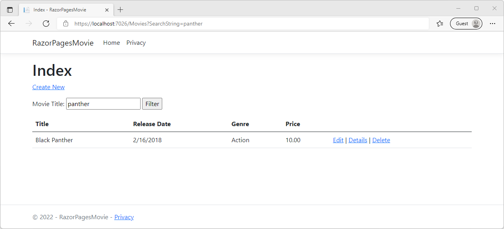

# Add search to a Razor page using Visual Studio for Mac

The following tutorial is based on [*"Get started with Razor Pages in ASP.NET Core"*](https://docs.microsoft.com/aspnet/core/tutorials/razor-pages/razor-pages-start) from docs.microsoft.com.

## Prerequisites

* [Visual Studio 2022 for Mac Preview](https://visualstudio.microsoft.com/vs/mac/preview/?wt.mc_id=adw-brand&gclid=Cj0KCQjwqYfWBRDPARIsABjQRYwLe3b9dJMixA98s8nS8QfuNBKGsiRVRXzB93fe4E27LGK5KLrGcnYaAgdREALw_wcB)
* In the Visual Studio for Mac Installer, install the .NET Core target.
* Tutorial 1- [Create a Razor Page application](../1-Create%20a%20Razor%20Page/Create-a-Razorpage-VSMac.md)
* Tutorial 2- [Add a Model](../2-Add%20a%20model/Addamodel-VSMac.md)
* Tutorial 3- [Update Page](../3-Update%20Pages/update-VSMac.md)

## Adding Search to a page

In this tutorial, you're going to add search to the Index Page. By the end of this tutorial, you'll be able to search by genre and name.

Open `Pages/Movies/Index.cshtml.cs` and replace the `OnGetAsync` method with the following code:

```csharp
public async Task OnGetAsync(string searchString)
{
    var movies = from m in _context.Movie
                 select m;

    if (!String.IsNullOrEmpty(searchString))
    {
        movies = movies.Where(s => s.Title.Contains(searchString));
    }

    Movie = await movies.ToListAsync();
}
```

### Test search string

* Run your application with F5 and open the Movies Page (`http://localhost:{port}/Movies`).
* Append the query string to the end `?searchString=[Film Title]` (for example, `http://localhost:{port}/Movies?searchString=panther`)

    

### Add a Search Box

#### Search by Title

1. Open the `Pages/Movies/Index.cshtml` file and add the `<form>` element as shown in the following code:

    ```html
    <h2>Index</h2>
    
    <p>
        <a asp-page="Create">Create New</a>
    </p>
    <form>
        <p>
            Movie Title: <input type="text" name="SearchString"/>
            <input type="submit" value="Filter"/>
        </p>
    </form>
    ```

1. Run the application by selecting **Debug** > **Run without Debugging** on the main menu.
1. If you haven't created a few movies, go ahead and do that now.
1. Enter a film title in the search box.

    

#### Search by Genre

1. Open the `Pages/Movies/Index.cshtml.cs` file and add the following code::

    ```csharp
    public class IndexModel : PageModel
    {
        private readonly RazorPagesMovie.Data.RazorPagesMovieContext _context;
    
        public IndexModel(RazorPagesMovie.Data.RazorPagesMovieContext context)
        {
            _context = context;
        }
    
        public IList<Movie> Movie;
        public SelectList Genres;
        public string MovieGenre { get; set; }
    ```

1. Add `using Microsoft.AspNetCore.Mvc.Rendering;` to the top of the class.

1. Update the `OnGetAsync` method on that same file:

    ```csharp
    public async Task OnGetAsync(string movieGenre,string searchString)
    {
        IQueryable<string> genreQuery = from m in _context.Movie
                                orderby m.Genre
                                select m.Genre;
    
        var movies = from m in _context.Movie
                    select m;
    
        if (!String.IsNullOrEmpty(searchString))
        {
            movies = movies.Where(s => s.Title.Contains(searchString));
        }
    
        if (!String.IsNullOrEmpty(movieGenre))
        {
            movies = movies.Where(x => x.Genre == movieGenre);
        }
        Genres = new SelectList(await genreQuery.Distinct().ToListAsync());
        Movie = await movies.ToListAsync();
    }
    ```

1. Open the `Pages/Movies/Index.cshtml` file and update the form element code:

    ```html
    <form>
        <p>
            <select asp-for="MovieGenre" asp-items="Model.Genres">
                <option value="">All</option>
            </select>
            
            Movie Title: <input type="text" name="SearchString">
             <input type="submit" value="Filter"/>
        </p>
    </form>
    ```

* Run the application by selecting **Debug** > **Run without Debugging** on the main menu.
* Navigate to `https://localhost:{port}/Movies`

    

Mission accomplished!


You've built your first Razor Page application with C# and ASP.NET Core.
