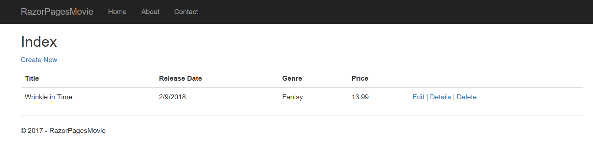
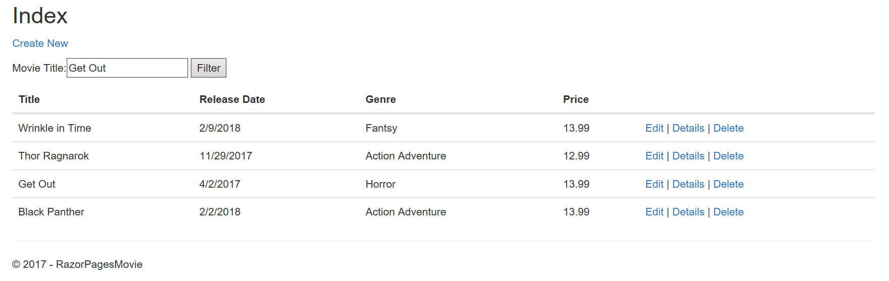
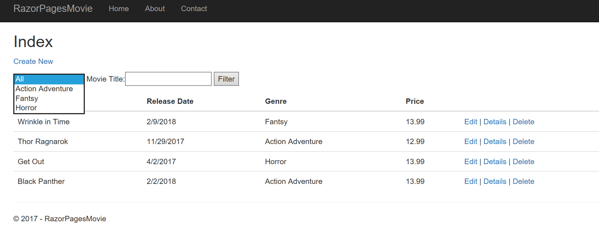

The tutorial below is based on [*"Get started with ASP.NET Core Razor Pages in Visual Studio Code"*](https://docs.microsoft.com/en-us/aspnet/core/tutorials/razor-pages-vsc/razor-pages-start) from docs.microsoft.com.

### Prerequisites
* [.NET Core SDK 3.0](https://dotnet.microsoft.com/download/dotnet-core/3.0)
*  [Visual Studio Code](https://code.visualstudio.com/?wt.mc_id=adw-brand&gclid=Cj0KCQjwqYfWBRDPARIsABjQRYwLe3b9dJMixA98s8nS8QfuNBKGsiRVRXzB93fe4E27LGK5KLrGcnYaAgdREALw_wcB)
* Tutorial 1- [Create a Razor Page application](../1-Create%20a%20Razor%20Page/Create-a-Razorpage.md)
* Tutorial 2- [Add a Model](../2-Add%20a%20model/Addamodel.md)
* Tutorial 3- [Update Page](../3-Update%20Pages/update.md)

## Adding Search to a page

In this quick tutorial we are going to search to the Index Page. By the end of this tutorial you can search by genre and name.

### Update the Index page's `OnGetAsync` method

#### Add code below to Movies/Index.cshtml
``` 
@{
    Layout = "_Layout";
}
```
#### Edit the Movies/Index.cshtml.cs
``` cs
public async Task OnGetAsync(string searchString)
{
    var movies = from m in _context.Movie
                 select m;

    if (!String.IsNullOrEmpty(searchString))
    {
        movies = movies.Where(s => s.Title.Contains(searchString));
    }

    Movie = await movies.ToListAsync();
}
```
### Test search string
- Run your application 
- Append the query string to the end `?searchString=Wrinkle`



### Add a Search Box
**Search by Title**

#### Open the Index.cshtml file and add the`<form>`
```
<h2>Index</h2>

<p>
    <a asp-page="Create">Create New</a>
</p>
<form>
    <p>
        Movie Title:<input type="text" name="SearchString">
         <input type="submit" value="Filter"/>
    </p>
</form>
```
- Run the application `http://localhost:5000/movies` 
- Enter a film title



**Search by Genre**
### Add the code below to Pages/Movies/Index.cshtml.cs

*Note you will need to add `using Microsoft.AspNetCore.Mvc.Rendering;`*
``` cs
public class IndexModel : PageModel
{
    private readonly RazorPagesMovie.Models.MovieContext _context;

    public IndexModel(RazorPagesMovie.Models.MovieContext context)
    {
        _context = context;
    }

    public IList<Movie> Movie;
    public SelectList Genres;
    public string MovieGenre { get; set; }
```

### Update `OnGetAsync` method
``` cs
public async Task OnGetAsync(string movieGenre,string searchString)
        {
            IQueryable<string> genreQuery = from m in _context.Movie
                                    orderby m.Genre
                                    select m.Genre;

            var movies = from m in _context.Movie
                        select m;

            if (!String.IsNullOrEmpty(searchString))
            {
                movies = movies.Where(s => s.Title.Contains(searchString));
            }

            if (!String.IsNullOrEmpty(movieGenre))
            {
                movies = movies.Where(x => x.Genre == movieGenre);
            }
            Genres = new SelectList(await genreQuery.Distinct().ToListAsync());
            Movie = await movies.ToListAsync();
        }
```
###  Update Index.cshtml
```
<form>
    <p>
        <select asp-for="MovieGenre" asp-items="Model.Genres">
            <option value="">All</option>
        </select>
        
        Movie Title:<input type="text" name="SearchString">
         <input type="submit" value="Filter"/>
    </p>
</form>
```
- Run the application `http://localhost:5000/movies`



Mission Accomplished


You've have built your first Razor Page application